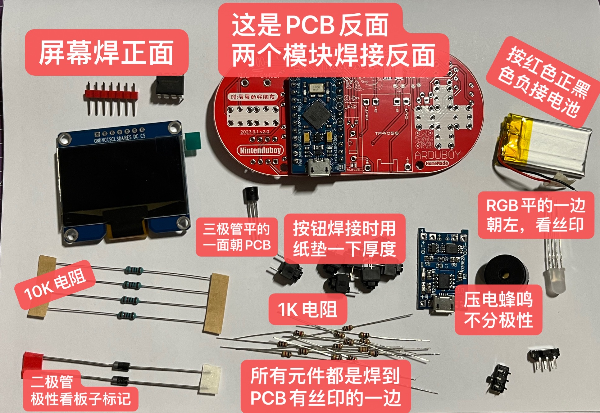
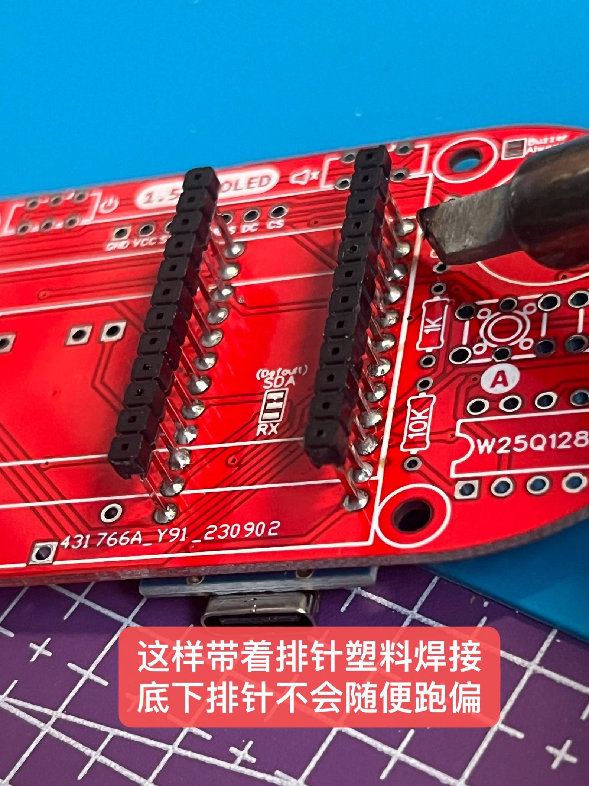
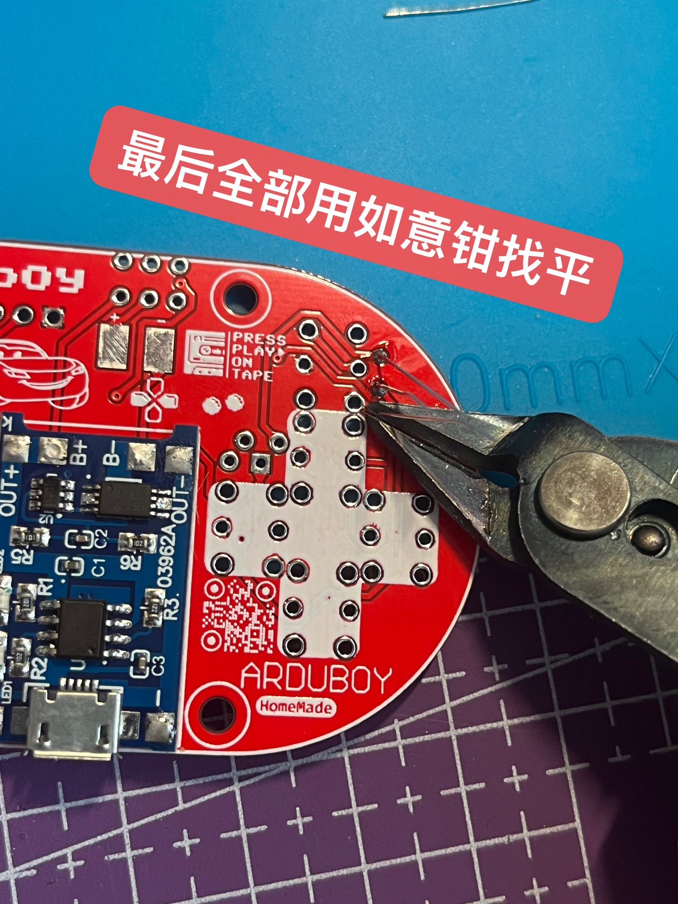
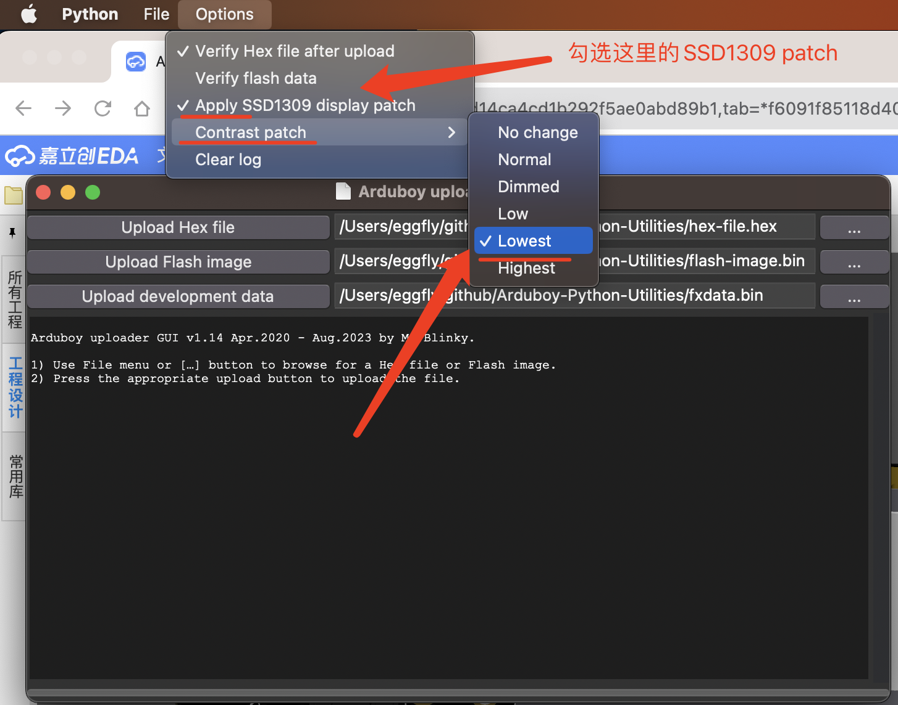
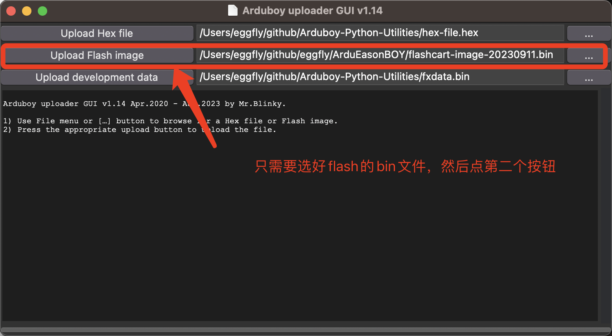

# ArduEasonBOY

My DIY variant of Arduboy.

给喜欢 Arduboy 游戏生态的爱好者们的一个全部使用模块和分立元件的版本。

也给我自己娃做几个玩一玩（他很喜欢全红色的版本）。

# BOM

ArduEasonBOY 套件包含的材料列表如下:
| Name | 数量 | 用途 |
| :-----| :----: | :----: |
| ArduEasonBOY PCB | 1 | 板子 |
| Pro Micro (ATmega32U4 @ 5V 16Mhz) | 1 | 主控 |
| 1.54" 白色 OLED 模块 SPI 7针 SSD1309  | 1 |  128*64 屏幕 |
| 锂电池充电模块-TP4056 | 1 | 电池充电 |
| 电阻 1kΩ | 5 | 三极管电路电阻 LED 限流电阻 |
| 电阻 10kΩ | 1 | FLASH_CS 默认上拉 |
| 压电蜂鸣器 | 1 | 游戏声音 |
| 共阳 RGB LED | 1 | 游戏彩灯 |
| 1N5819（肖特基二极管） | 1 | 电池防倒流 |
| 2N3906（PNP 三极管） | 1 | 单元格 |
| W25Q128FVIQ | 1 | 16MB FLASH 游戏卡带 |
| 可充电锂电池 | 1 | 电池直接供电 |
| MSK22D18G2 拨动开关/两档侧式 6脚插件 | 2 | 锂电池开关 蜂鸣器静音开关 |
| CMI627301D07 6.2 * 6.2 * 7.3mm 直插 轻触开关 | 7 | 6个游戏按钮 1个RESET按钮 |

成品视频:

<video src="images/boy.mp4" controls title="Title"></video>

# ArduEasonBOY 焊接教程

* 按照上面BOM表格和下方照片检查元件材料清单

* 关于反正面千万不要焊接错：

正面元件: 屏幕，7个按钮，1个10K电阻，5个1K电阻，一个Flash，一个RGB LED，两个开关，一个蜂鸣器
反面元件: Pro Micro，TP4056，三极管，二极管，锂电池

* 在背面焊接 Pro Micro 和 TP4056 模块，如图：

* 关于焊接顺序：

先焊接背面的两个模块，然后剪掉排针，还有焊接三极管二极管。再焊接正面，因为正面OLED屏幕会盖住，那样背面无法焊接 @wryyyyyyyyy！ 

* 焊接其他元件，所有元件参考丝印或者这个3D渲染就行

<video src="images/3d.mp4" controls title="3D"></video>

* 使用如意钳给背面突出的针脚剪掉找平

如何刷 300+ 游戏 Flash？
* https://github.com/MrBlinky/Arduboy-Python-Utilities clone 下来，装一下readme里面的依赖，然后python3 运行 `upload-gui.py`
* 一定记得勾选 SSD1309 patch，不然屏幕位置是错位的

* 选 bin 文件然后点第二个按钮

耐心等待几分钟，日志里显示 Flash 烧写成功即可开始玩游戏！
