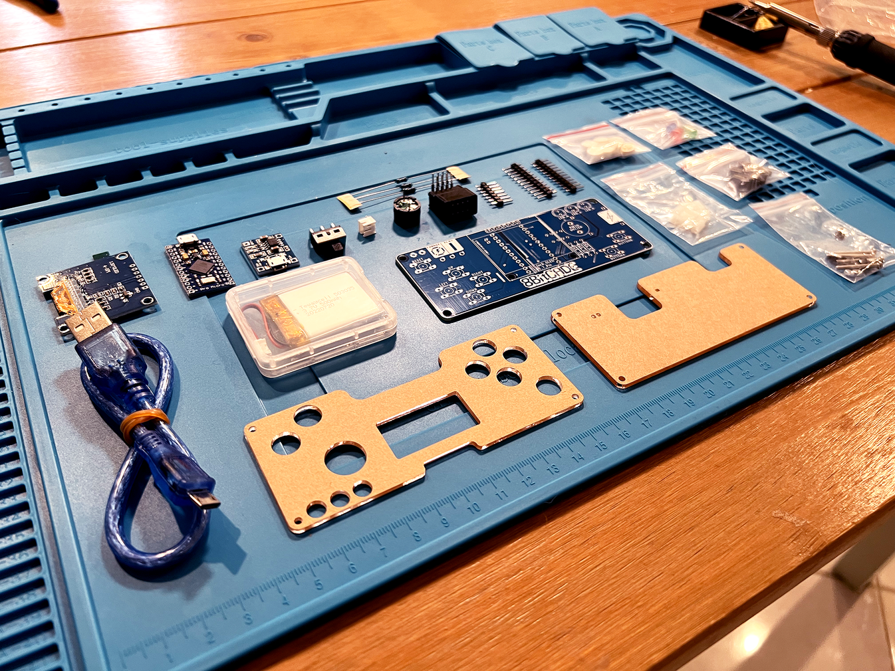

# ArduEasonBOY
My DIY variant of Arduboy

# BOM

ArduEasonBOY 套件包含的材料列表如下:
| Name | 数量 | 用途 |
| :-----| :----: | :----: |
| ArduEasonBOY PCB | 1 | 板子 |
| Pro Micro (ATmega32U4 @ 5V 16Mhz) | 1 | 主控 |
| 1.54" 白色 OLED 模块 SPI 7针 SSD1309  | 1 |  128*64 屏幕 |
| 锂电池充电模块-TP4056 | 1 | 电池充电 |
| 电阻 1kΩ | 5 | 三极管电路电阻 LED 限流电阻 |
| 电阻 10kΩ | 1 | FLASH_CS 默认上拉 |
| 压电蜂鸣器 | 1 | 游戏声音 |
| 共阳 RGB LED | 1 | 游戏彩灯 |
| 1N5819（肖特基二极管） | 1 | 电池防倒流 |
| 2N3906（PNP 三极管） | 1 | 单元格 |
| W25Q128FVIQ | 1 | 16MB FLASH 游戏卡带 |
| 可充电锂电池 | 1 | 电池直接供电 |
| MSK22D18G2 拨动开关/两档侧式 6脚插件 | 2 | 锂电池开关 蜂鸣器静音开关 |
| CMI627301D07 6.2 * 6.2 * 7.3mm 直插 轻触开关 | 7 | 6个游戏按钮 1个RESET按钮 |

ArduEasonBOY 焊接教程

